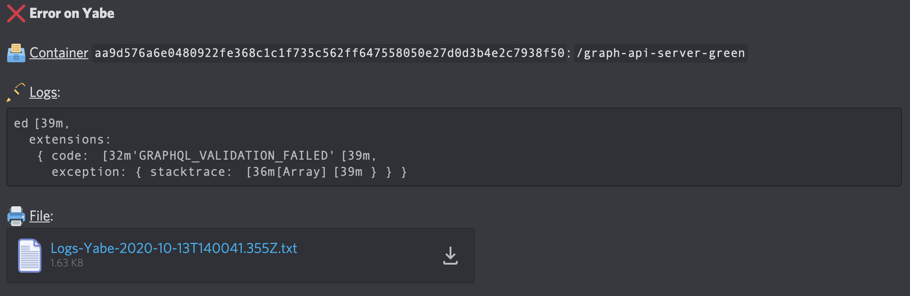

# Docker Discord logger

Log  docker errors container on channel discord



## 🔧 Install
```bash
npm i
```

❗ **Bot needs some environment variables:**

### Application
- `APP_NAME` The application name, it will be show in discord message

### Discord
The bot log the errors into one specified channel
- `DISCORD_CLIENT_TOKEN` The token of the discord bot, can be obtained on [discord platform](https://discord.com/developers/applications)
- `DISCORD_SERVER_ID` A hash of the server discord
- `DISCORD_CHANNEL_ID` A hash of the text channel

> You can get the different Discord ids with the discord [dev mode](https://discordia.me/en/developer-mode)

### Docker
The bot scan all currently running docker containers at the start and try to find a container name specified by matching
- `DOCKER_CONTAINERS` An array json who contains regex or string

### Logs
- `LOGS_LINE_NB` The number of lines stored before an error
- `LOGS_REGEX` The pattern matching to trigger a discord message

## 👨‍💻 Development
```bash
npm run dev
```

## 🖥️ Production
```bash
npm start
```
You can run this script into docker himself by passing the socket into a volume
```bash
# Build
docker build -t username/discord-docker-logger .

# Run
docker run -v /var/run/docker.sock:/var/run/docker.sock --env-file .env username/discord-docker-logger:latest
```
